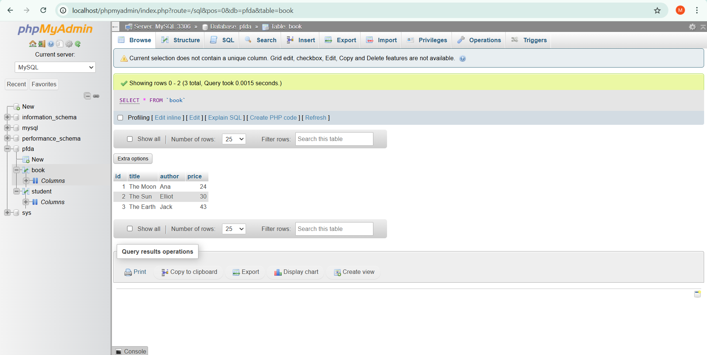

#  Creating a table in mysql.

#### 2. Make a table called book that has 4 columns (id, title, author, price) and insert some data into it.

`show databases;`

`create database pfda;` # If database doesn't exist.

`use pfda;`

`create table book (
id int,
title varchar(100),
author varchar(100),
price int
);`

`insert into book (id, title, author, price) values (1, 'The Moon', 'Ana', 24);`

`insert into book (id, title, author, price) values (2, 'The Sun', 'Elliot', 30);`

`insert into book (id, title, author, price) values (3, 'The Earth', 'Jack', 43);`

`select * from book;`

#### 3. Look at the tables in phpmyadmin.

